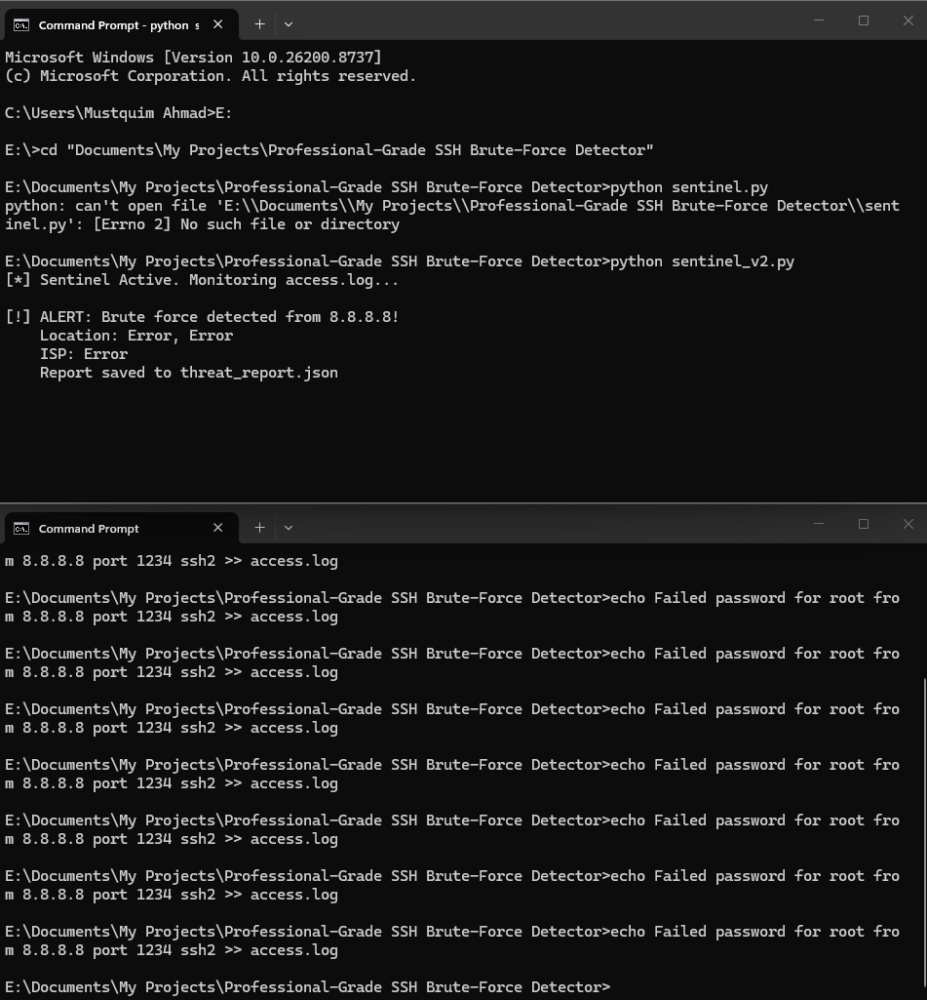

# SSH Sentinel: Real-Time Brute-Force Detection Tool

## 🛡️ Project Overview

SSH Sentinel is a Python-based Intrusion Detection System (IDS) designed to monitor system logs for SSH brute-force attacks. It identifies suspicious IP addresses in real-time, performs threat intelligence enrichment via API, and generates structured security reports.

## ✨ Features

- **Real-time Monitoring:** Uses event-driven log parsing (similar to `tail -f`).
- **Threat Intelligence:** Automatically fetches Geolocation and ISP data for attacker IPs.
- **Automated Reporting:** Generates a `threat_report.json` for SIEM ingestion.
- **Secure Code:** Implemented with path validation and memory-efficient streaming.

## 🚀 Installation & Usage

1. Clone the repo: `git clone https://github.com/YourUsername/SSH-Sentinel.git`
2. Install dependencies: `pip install -r requirements.txt`
3. Run the tool: `python sentinel.py`

## 📊 Sample Output

